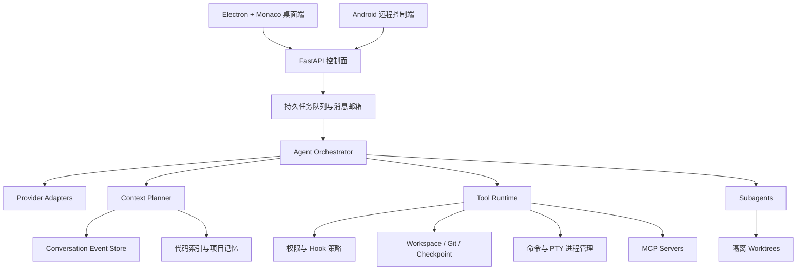
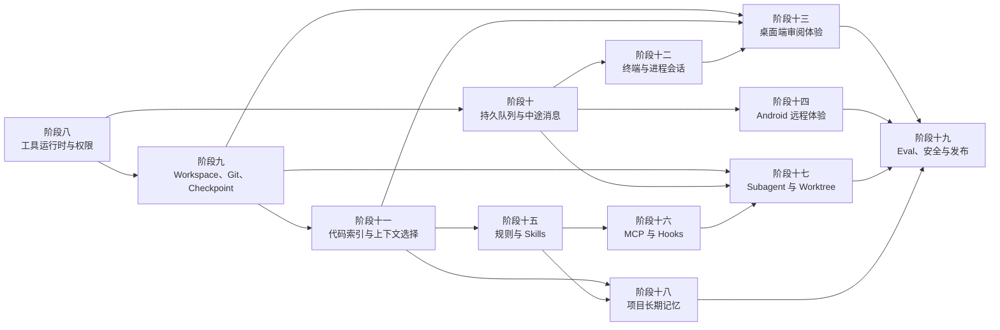

# Android Agent 下一阶段完整路线图与实施提示词

## 1. 结论

本项目不应直接复制 Cursor、Codex 或 Claude Code，而应发展成一个以 Android 开发为中心的 Agent 工作台：

- 桌面端是主要编辑、审阅、终端和多任务控制界面。
- Android 手机端是远程下达任务、审批、查看进度、下载并安装 APK 的控制端。
- Python Agent 是统一执行内核，负责模型、工具、权限、事件、恢复、索引和工作区。
- 生成 Android App、自动构建、安装验证是本项目区别于通用 Coding Agent 的核心优势。

**紧接着应做的不是多 Agent，也不是长期记忆，而是“统一工具运行时与权限策略”。**

当前项目已经能可靠保存完整模型与工具事件，但工具执行仍主要由 `agent/tools.py` 中的固定函数和条件分支承担。如果此时直接增加 MCP、子 Agent 或任意终端命令，权限、取消、审批、重放和事件记录会快速分叉。因此必须先建立统一执行内核，再向上叠加 Git、队列、检索和客户端体验。

## 2. 当前能力基线

### 2.1 已具备

- OpenAI-compatible 与 Anthropic Provider。
- 模型和 Provider fallback。
- 流式模型输出。
- 规范的 `conversation_turns` 和 `conversation_events`。
- 完整保存用户消息、模型响应、工具调用、工具结果和 usage。
- Provider 无关的历史上下文重建。
- 旧 `turns_json` 幂等迁移和兼容投影。
- 下载审批持久化。
- 工具链中断修复和有限自动恢复。
- 结构化 checkpoint 和任务内 compact。
- 凭证字段拒绝写入和常见自由文本密钥脱敏。
- Conversation Event 分页 API。
- FastAPI、WebSocket 和任务事件流。
- Android 项目模板、文件工具、Gradle 构建和 APK 下载。
- Electron + Monaco 桌面编辑器、Conversation、流式消息和审批基础。
- Android 客户端项目、任务、日志、文件、APK 下载和安装基础。
- 100 项不调用真实模型或网络的 Python 测试。

### 2.2 主要差距

| 领域 | 当前状态 | 达到成熟 Coding Agent 所需能力 |
| --- | --- | --- |
| 工具内核 | 固定工具和分支调度 | Tool Registry、统一权限、超时、取消、并发和生命周期 |
| 命令执行 | 主要是固定 Gradle 任务 | 安全的非交互命令、PTY 终端、进程树终止 |
| 工作区 | 模板项目和有限文件 API | 现有仓库导入、Git 状态、checkpoint、diff、回滚 |
| 代码理解 | glob、grep、read_file | Repo map、增量索引、符号和引用检索、上下文预算器 |
| 任务执行 | 后台线程和启动恢复 | 持久队列、中途追加消息、暂停、恢复、硬取消 |
| 审阅 | 改动文件列表 | 逐文件 diff、逐块接受/拒绝、checkpoint 恢复 |
| 桌面端 | 已接入基础 Agent | Terminal、Diff Editor、上下文附件、计划、队列和事件时间线 |
| 手机端 | 单任务调试控制台 | 多 Conversation、WebSocket、审批、diff 摘要和断线续传 |
| 项目规则 | 固定系统 Prompt | AGENTS.md、目录规则、用户规则、可复用 Skills |
| 扩展协议 | 内置工具 | MCP 客户端、动态工具、Hooks |
| 并行能力 | 单 Agent | 受限 Subagent、工作树隔离、任务依赖 |
| 长期记忆 | Conversation checkpoint | 项目记忆候选、用户审批、检索和可删除性 |
| 质量体系 | 单元与 fake 集成测试 | Eval 场景集、故障注入、性能和安全审计 |

README 中“桌面端 AI 占位”的描述已经落后于代码。桌面端目前已经连接 Agent，但仍缺少成熟 IDE Agent 的审阅和执行体验。

## 3. 目标架构



核心边界：

1. `conversation_events` 继续是模型上下文和审计的权威来源。
2. `task_events` 继续是 UI 流式状态，不承担模型历史。
3. 所有内置工具、命令、MCP 工具都必须经过同一 Tool Runtime。
4. 权限判断与工具实现分离，模型不能通过换工具名绕过策略。
5. 工作区修改必须可 diff、可审阅、可恢复。
6. 持久队列负责运行生命周期，WebSocket 只是实时视图。
7. Subagent 不得直接共享可写目录，写任务必须用 worktree 隔离。

## 4. 依赖顺序



## 5. 里程碑

### 里程碑 A：真正可日常使用的单 Agent

完成阶段八至十三后，应达到：

- 能安全执行通用 Android 开发命令。
- 能导入或管理 Git 项目。
- 每轮改动都有 checkpoint 和可审阅 diff。
- 服务重启、客户端断线和中途追加要求不会丢失。
- Agent 能通过代码索引选择上下文。
- 桌面端具备聊天、编辑、终端、diff 和恢复闭环。

### 里程碑 B：手机端与可扩展生态

完成阶段十四至十六后，应达到：

- 手机端可远程管理多 Conversation 和审批。
- 项目可声明稳定规则和可复用工作流。
- MCP 工具与生命周期 Hooks 可安全接入。

### 里程碑 C：并行自治与长期质量

完成阶段十七至十九后，应达到：

- 可将检索、测试、审阅等任务交给隔离 Subagent。
- 项目记忆可跨 Conversation 使用且由用户控制。
- 有稳定的 Eval、安全审计、性能预算和发布流程。

## 6. 分阶段实施提示词

下面每个提示词都是独立可执行的。必须按顺序实施；完成一个阶段并通过全部测试后，再发送下一个阶段。

---

# 阶段八提示词：统一 Tool Runtime、权限策略与可取消进程

```text
# 阶段八：统一 Tool Runtime、权限策略与可取消进程

项目路径：`/Users/Mac/Android-Agent`

请直接阅读代码并完成本阶段修改，不要只输出方案或伪代码。

## 通用要求

- 只完成本阶段，不提前实现 Git checkpoint、持久队列、PTY、MCP 或 Subagent。
- 保留工作区已有改动，不覆盖或回滚无关代码。
- 禁止使用 `git reset`、`git checkout` 等破坏性命令。
- 不修改 `config.yaml` 或任何 API Key。
- 不调用真实模型或真实网络，测试全部使用 fake/mock。
- 保持现有 API、Conversation Event、task_events、WebSocket、桌面端和 Android 客户端兼容。
- 所有现有 100 项 Python 测试必须继续通过。

## 开始前阅读

- `agent/tools.py`
- `agent/loop.py`
- `agent/jobs.py`
- `agent/approvals.py`
- `agent/conversation_events.py`
- `agent/config.py`
- `tests/test_mvp_core.py`
- `tests/test_conversation_integration.py`
- `tests/test_approval_recovery.py`

## 目标

把内置工具从 `dispatch_tool()` 的条件分支升级为统一、可审计的 Tool Runtime。模型调用任何内置工具都必须依次经过：

1. 工具定义与输入校验。
2. 风险分类。
3. 权限决策。
4. 审批（需要时）。
5. 执行、超时与取消。
6. 统一结果标准化。
7. 规范事件和 UI 事件记录。

## 建议模块

- `agent/tool_runtime.py`
- `agent/tool_registry.py`
- `agent/permissions.py`
- `agent/processes.py`

## ToolSpec

至少包含：

- `name`
- `description`
- `input_schema`
- `category`
- `read_only`
- `workspace_write`
- `network_access`
- `starts_process`
- `default_timeout_seconds`
- `approval_kind`
- `replay_policy`
- `handler`

Tool Registry 必须成为内置工具定义的唯一来源；OpenAI 和 Anthropic 的工具 schema 从 Registry 投影，不保留另一套手写定义主流程。

## 权限模型

支持风险级别：

- `read`
- `workspace_write`
- `network`
- `process`
- `destructive`

支持运行模式：

- `ask`：风险操作请求审批。
- `workspace`：允许工作区内普通读写，网络和破坏性操作仍审批。
- `read_only`：只允许只读工具。

权限判断返回结构化决定：

- `allow`
- `deny`
- `ask`
- `reason`
- `matched_rule`

现有 `download_file` 审批行为必须保持兼容。服务中断后的副作用重放审批必须继续有效，但改为使用统一权限入口。

## 命令执行基础

本阶段新增非交互 `run_command` 内核，但暂不开放任意 PTY：

- 参数使用 argv 数组，不使用 `shell=True`。
- cwd 必须在 workspace 内。
- 环境变量采用最小允许列表，不把服务端 API Key 传给子进程。
- 支持 stdout/stderr 合并或分离、退出码、耗时、超时。
- 支持通过取消 token 终止整个进程组。
- 限制单次输出大小，完整输出可写任务日志，模型输出使用明确截断标记。
- 测试只能执行本地无副作用的 fake 脚本或 Python 子进程。

现有 `run_gradle` 改为复用 Process Runner，但外部行为、日志和 APK 逻辑不变。

## 事件要求

- `tool_call` 必须在执行前写入。
- 权限拒绝和审批拒绝也必须形成 `tool_result`。
- 超时、取消、启动失败必须有不同的 `error_type`。
- `model_output` 必须是实际返回模型的字符串。
- 不逐块写 Conversation Event；高频输出只进入 task_events。

## 测试

新增聚焦测试，至少覆盖：

1. Registry 注册、重复工具名和 schema 投影。
2. read、workspace_write、network、process、destructive 分类。
3. 三种权限模式。
4. deny 时 handler 不执行。
5. ask 时沿用审批事件链。
6. 工具执行成功、失败、异常和超时。
7. 取消时终止子进程组。
8. 环境变量不泄露 API Key。
9. OpenAI 与 Anthropic 使用同一 Registry。
10. 现有下载、Gradle、恢复重放测试不回归。

## 本阶段禁止

- 不新增 Git 操作。
- 不新增终端 WebSocket。
- 不实现 MCP。
- 不实现规则文件或 Skills。
- 不实现 Subagent。

## 验证

运行：

`python3 -m unittest discover -s tests -v`
`python3 -m py_compile agent/*.py`
`git diff --check`

最终回复列出 ToolSpec、权限流程、进程取消策略、修改文件和测试结果。
```

---

# 阶段九提示词：Workspace、Git、Checkpoint、Diff 与恢复

```text
# 阶段九：Workspace、Git、Checkpoint、Diff 与恢复

项目路径：`/Users/sakura/Android Agent`

请在阶段八已经完成的基础上直接实施。

## 通用要求

- 不调用真实模型或网络。
- 不自动 commit、push、force checkout 或丢弃用户改动。
- 不修改 `config.yaml` 和密钥。
- 保持模板创建、旧项目目录和全部现有 API 兼容。
- 所有恢复操作必须先检测冲突，不能覆盖任务开始后产生的手工修改。

## 阅读

- `agent/project.py`
- `agent/changes.py`
- `agent/tools.py`
- `agent/tool_runtime.py`
- `agent/jobs.py`
- `agent/database.py`
- `agent/api.py`
- 桌面端文件打开和保存逻辑

## 目标

新增统一 `WorkspaceRepository`，让模板项目和现有 Git Android 项目共享：

- 仓库状态。
- Agent checkpoint。
- turn 前后 diff。
- 文件级和整轮恢复。
- 后续 worktree 隔离需要的 Git 元数据。

## 项目来源

项目记录增加兼容字段：

- `source_kind`: `template|git|imported`
- `source_url`
- `default_branch`
- `repo_root`

本阶段支持：

- 现有 template 创建方式。
- 从本地 Git fixture 导入到用户隔离 workspace。
- Git clone 的接口和服务层可实现，但测试不得访问网络；网络 clone 必须走统一 network 审批。

不得直接把用户任意目录作为可写 workspace；导入时复制或 clone 到受管理目录。

## Checkpoint

新增数据结构，至少记录：

- `id`
- `user_id`
- `project_id`
- `conversation_id`
- `turn_id`
- `task_id`
- `kind`: `before_turn|after_turn|manual`
- `base_revision`
- `manifest_json`
- `created_at`

要求：

- turn 第一次写入前创建 `before_turn`。
- turn 结束后创建 `after_turn`。
- checkpoint 只保存允许工作区内的文件状态。
- 内容可使用 SHA-256 内容寻址并去重。
- checkpoint 与 Git commit 分离，不污染用户提交历史。
- 恢复前比较当前文件 hash；存在任务外修改时返回冲突，不静默覆盖。
- 重复创建或恢复具有幂等键。

## Git 与 Diff 工具

新增只读工具：

- `git_status`
- `git_diff`
- `git_log`

新增服务能力：

- turn diff。
- checkpoint diff。
- 当前 workspace 与 checkpoint diff。
- 逐文件恢复。
- 整个 checkpoint 恢复。

Diff 返回结构化文件列表及 unified diff；大 diff 有大小限制和明确截断信息。

## API

新增最小接口：

- `GET /api/projects/{project_id}/workspace/status`
- `GET /api/projects/{project_id}/diff`
- `GET /api/projects/{project_id}/checkpoints`
- `POST /api/projects/{project_id}/checkpoints/{checkpoint_id}/restore`

严格执行用户隔离；其他用户访问返回 404。

## 测试

至少覆盖：

1. template 项目 checkpoint。
2. 本地 Git fixture 导入。
3. dirty、untracked、renamed、deleted 文件状态。
4. turn 前后 diff。
5. 内容去重。
6. 单文件和整轮恢复。
7. 手工修改冲突不被覆盖。
8. checkpoint 幂等。
9. 路径越界和符号链接越界。
10. 用户隔离。
11. 旧项目无 Git 时仍可工作。
12. 不自动 commit 或 push。

## 禁止

- 不实现逐块 diff UI。
- 不实现 worktree 并行。
- 不执行真实 clone 网络请求。
- 不实现 GitHub API。

## 验证

运行全部 Python 测试、`git diff --check`，并用临时 Git fixture 完成集成测试。

最终回复说明工作区来源、checkpoint 存储、冲突检测、API 和测试结果。
```

---

# 阶段十提示词：持久任务队列、中途消息与可靠取消

```text
# 阶段十：持久任务队列、中途消息与可靠取消

项目路径：`/Users/sakura/Android Agent`

请直接实施本阶段，只处理任务控制面，不改桌面或 Android UI。

## 通用要求

- 不调用真实模型或网络。
- 保留现有 Task、Turn、Conversation Event 和 WebSocket 兼容。
- SQLite 是第一版队列的权威来源，不引入 Redis。
- 同一项目仍只允许一个可写任务运行。
- 服务重启后不得丢失 queued 消息或依赖内存线程才能恢复。

## 阅读

- `agent/jobs.py`
- `agent/database.py`
- `agent/loop.py`
- `agent/stream.py`
- `agent/conversation_events.py`
- `agent/tool_runtime.py`
- `agent/processes.py`
- `agent/api.py`

## 目标

将“创建线程立即运行”改为持久化 worker 模型：

1. API 创建 Task、Turn 和 user_message。
2. Task 进入 SQLite 队列。
3. Worker 原子 claim。
4. 执行 Agent。
5. 在安全点读取取消、暂停和新消息。
6. 完成后提交终态。

## 数据

新增或扩展：

- Task claim owner、lease、heartbeat、attempt。
- `task_messages`：中途输入邮箱。
- `task_dependencies`：先实现单父依赖，为后续 Subagent 准备。

消息类型：

- `steer`：当前模型响应结束后的下一个安全点注入。
- `follow_up`：当前 Turn 完成后自动创建下一 Turn。
- `cancel`：请求停止。

消息必须有稳定 `message_key` 并幂等消费。

## Worker

- 使用 `BEGIN IMMEDIATE` 或等价事务 claim。
- lease 超时后可由新 worker 接管。
- heartbeat 不写 Conversation Event。
- 一个 Task 同时只能被一个 worker 执行。
- 服务重启后 queued 继续执行，running 先按现有规则修复工具链，再进入明确的 recovery task。
- 不自动重放已完成副作用工具。

## 取消

- 模型调用前、工具调用前、工具执行中、响应完成后检查取消。
- 进程工具使用阶段八的进程组终止。
- 取消必须形成一致的 Task、Turn 和规范事件终态。
- 增加有限 grace period，超时后强制终止子进程。

## API

新增：

- `POST /api/jobs/{job_id}/messages`
- `GET /api/jobs/{job_id}/messages`
- `POST /api/jobs/{job_id}/pause`
- `POST /api/jobs/{job_id}/resume`

保持现有 cancel API。

WebSocket 支持 `after_event_id` 或等价游标重连，不能靠客户端记住数组长度。

## 测试

至少覆盖：

1. API 返回前 user_message 已持久化。
2. worker 原子 claim。
3. 两 worker 不重复执行。
4. queued 任务重启后继续。
5. lease 过期接管。
6. steer 在安全点只注入一次。
7. follow_up 创建下一 Turn。
8. cancel 终止 fake 长进程。
9. pause/resume。
10. WebSocket 游标重连无重复无遗漏。
11. 同项目串行、不同项目可配置并行。
12. task_events 与 conversation_events 职责不混淆。

## 禁止

- 不实现多 Agent。
- 不实现云队列。
- 不新增桌面和手机 UI。

完成后运行全部 Python 测试并报告队列状态机、lease、消息语义和测试结果。
```

---

# 阶段十一提示词：Android 代码索引、Repo Map 与上下文选择

```text
# 阶段十一：Android 代码索引、Repo Map 与上下文选择

项目路径：`/Users/sakura/Android Agent`

请实现本地、可增量、无需网络的代码理解层。

## 通用要求

- 不调用 embedding API、真实模型或网络。
- 不删除 glob、grep、read_file 等现有工具。
- 索引是可重建缓存，Conversation Event 仍是会话权威来源。
- 索引损坏不得阻止项目打开，应可安全重建。

## 阅读

- `agent/tools.py`
- `agent/tool_runtime.py`
- `agent/project.py`
- `agent/conversation_context.py`
- `agent/compact.py`
- `agent/jobs.py`
- `agent/database.py`

## 目标

建立四层代码上下文：

1. 文件清单与语言、大小、hash。
2. SQLite FTS5 文本检索。
3. Kotlin、Java、XML、Gradle 的符号和引用索引。
4. 面向模型预算的 Repo Map 与 Context Planner。

## 索引数据

至少包含：

- `workspace_files`
- `workspace_symbols`
- `workspace_references`
- FTS5 内容表
- index generation、状态和错误诊断

增量依据使用文件 hash，不按每次任务全库重扫。

忽略：

- `.git`
- `.gradle`
- `build`
- 二进制文件
- 超过配置上限的大文件
- 用户配置的 ignore patterns

## Android 语义

至少识别：

- Kotlin/Java package、class、interface、object、function、field。
- XML layout id、resource 名、字符串资源、Manifest component。
- Gradle module、dependency 坐标和 plugin。
- ViewBinding 布局与生成 binding 名的关联。
- Manifest Activity 与源码类的关联。

优先使用成熟解析库；解析失败时降级为明确标记的轻量提取，不让单文件阻止整个索引。

## 工具

新增只读工具：

- `repo_map`
- `search_code`
- `find_symbol`
- `find_references`
- `related_files`

所有工具通过阶段八 Tool Runtime 注册。

## Context Planner

输入：

- 用户 Prompt。
- 当前编辑文件和选区（可选）。
- 历史规范事件。
- token/字符预算。

输出：

- 选中文件或片段。
- 选择原因。
- 估算成本。
- 被排除项和截断信息。

要求：

- 当前 Prompt 只出现一次。
- 不把同一文件完整内容和重复片段同时加入。
- 优先当前文件、直接符号、引用、相关资源，再考虑全文检索结果。
- 为模型输出和工具结果预留预算。
- Provider 转换仍由 `conversation_context.py` 完成。

## API

新增只读接口：

- `GET /api/projects/{project_id}/index/status`
- `POST /api/projects/{project_id}/index/rebuild`
- `GET /api/projects/{project_id}/search?q=...`
- `GET /api/projects/{project_id}/symbols?...`

## 测试

使用小型 Android fixture，至少覆盖：

1. 首次索引和增量更新。
2. 删除、重命名文件。
3. Kotlin/Java 符号。
4. XML resource 和 ViewBinding 关联。
5. Manifest Activity 关联。
6. Gradle dependency。
7. FTS5 排序稳定。
8. 大文件和二进制忽略。
9. 损坏索引重建。
10. Context Planner 预算和去重。
11. 用户隔离和路径安全。
12. 八轮以上历史仍可与检索上下文共存。

最终回复说明索引层次、增量策略、Context Planner 和测试结果。
```

---

# 阶段十二提示词：终端、PTY 与长进程会话

```text
# 阶段十二：终端、PTY 与长进程会话

项目路径：`/Users/sakura/Android Agent`

请只实现后端终端和进程会话能力，不改桌面 UI。

## 通用要求

- 终端只能在当前用户的受管理 workspace 内启动。
- 不把 API Key、Bearer Token 或服务进程完整环境传入终端。
- 危险命令必须经过统一权限策略。
- 测试不得执行网络命令或破坏性命令。
- Windows 可暂不支持 PTY，但接口设计不能绑定 Electron。

## 阅读

- `agent/processes.py`
- `agent/tool_runtime.py`
- `agent/permissions.py`
- `agent/jobs.py`
- `agent/api.py`
- `agent/redaction.py`

## 目标

新增 Terminal Session：

- 创建、输入、输出、resize、关闭。
- stdout/stderr 以递增序号保存有限环形缓冲。
- WebSocket 断线可从游标续传。
- Agent 的非交互 `run_command` 与用户 PTY 共用底层进程生命周期管理。

## 数据和状态

状态：

- `starting`
- `running`
- `exited`
- `failed`
- `terminated`

记录：

- session id、user、project、cwd。
- argv 或 shell profile。
- pid、开始和结束时间、退出码。
- 最后输出序号。

不持久化完整环境变量。

服务重启后原 PTY 标记 interrupted，不尝试伪恢复原进程。

## API

- `POST /api/projects/{project_id}/terminals`
- `GET /api/projects/{project_id}/terminals`
- `GET /api/terminals/{terminal_id}`
- `POST /api/terminals/{terminal_id}/input`
- `POST /api/terminals/{terminal_id}/resize`
- `DELETE /api/terminals/{terminal_id}`
- `WebSocket /api/ws/terminals/{terminal_id}`

## 安全

- cwd realpath 必须在 workspace。
- 终端默认使用受限环境。
- 网络和 destructive 命令触发审批或拒绝。
- 输出经过脱敏后再进入日志和 WebSocket。
- 限制会话数量、空闲时长、单帧和缓冲区大小。
- 关闭时终止进程组和子进程。

## 测试

至少覆盖创建、输入输出、resize、退出码、超时、取消、断线续传、缓冲截断、重启中断、用户隔离、路径越界、环境脱敏和资源上限。

完成后运行全部 Python 测试，并报告 PTY 实现、游标、终止策略和安全边界。
```

---

# 阶段十三提示词：桌面端完整 Agent IDE 体验

```text
# 阶段十三：桌面端完整 Agent IDE 体验

项目路径：`/Users/sakura/Android Agent`

请直接实现 Electron + Monaco 桌面端，不做营销页。

## 通用要求

- 延续现有紧凑、工作型三栏 IDE 设计。
- 不重写 Electron 主进程和现有 Monaco 编辑器。
- 使用现有 Agent API；缺少的小型只读接口可以补充。
- Electron 保持 `contextIsolation`，渲染进程不能获得任意 Node 权限。
- 不调用真实模型或网络。
- 不覆盖未保存的编辑器内容。

## 阅读

- `desktop/src/index.html`
- `desktop/src/styles.css`
- `desktop/src/renderer.js`
- `desktop/src/ai-panel.js`
- `desktop/src/agent-api.js`
- `desktop/src/main.js`
- `desktop/src/preload.js`
- 阶段九至十二新增 API

## 目标布局

- 左侧：项目、文件树、搜索、Conversation 和运行任务。
- 中间：Monaco 编辑器、Diff Editor、终端面板。
- 右侧：Agent 对话、计划、工具、审批和上下文。
- 底部：问题、输出、构建日志、终端 tabs。

禁止把所有功能堆成卡片；使用 tabs、split panes、tree、list 和 toolbar。

## 必须实现

1. Conversation 新建、切换、重命名、归档和历史恢复。
2. 当前文件、选区、文件夹和诊断作为 prompt context chip。
3. Agent plan/todo 可折叠展示，状态实时更新。
4. tool_call/tool_result 配对展示，支持查看完整输入输出。
5. WebSocket 游标重连，断线后不重复消息。
6. queued/running/paused/awaiting_approval/failed 等完整状态。
7. 中途发送 steer、follow_up、pause、resume、cancel。
8. Monaco Diff Editor 展示 turn diff。
9. 文件级恢复和 checkpoint 整轮恢复，冲突时明确提示。
10. 审批面板按风险类型显示，不只支持下载文案。
11. xterm.js 终端，支持多 tab、resize、关闭和重连。
12. 点击错误位置、改动文件、搜索结果可打开 Monaco 对应行。
13. token、耗时、Provider/Model、fallback 和 recovery 可查看但不喧宾夺主。

## 易用性

- `Cmd/Ctrl+Enter` 发送。
- `Escape` 或明确按钮停止/关闭浮层。
- 输入框可自动增长但不遮挡审批和运行状态。
- 长工具输出虚拟化或折叠。
- 窄窗口不重叠，允许隐藏左右栏。
- 所有图标按钮有 tooltip。
- 使用现有图标库；若未安装，选择一个轻量图标库统一使用。

## 测试与验证

- 为 `AgentApi`、事件归并和状态 reducer 增加可运行的 JS 单元测试。
- 所有 `desktop/src/*.js` 运行 `node --check`。
- 使用 fake FastAPI 服务或 fixture 测试断线重连、审批和 diff。
- 启动 Electron 或浏览器可测页面，使用 Playwright 截图检查 1440x900、1024x768 和窄窗口。
- 检查无重叠、终端可见、Diff Editor 可见、输入区不遮挡按钮。

更新 README 中“AI 占位”的过时描述。

最终回复列出交互、快捷键、状态恢复、截图验证和测试结果。
```

---

# 阶段十四提示词：Android 手机端远程 Agent 完整体验

```text
# 阶段十四：Android 手机端远程 Agent 完整体验

项目路径：`/Users/sakura/Android Agent`

请直接实现 Android 客户端，继续使用 Kotlin + XML + ViewBinding，不迁移 Compose。

## 通用要求

- minSdk 保持 24。
- 不在手机端保存模型 API Key。
- 保持现有服务器地址、Token、项目和 APK 安装兼容。
- 不把手机端做成完整 IDE；定位是远程控制、审批、审阅和安装。
- 不调用真实模型或网络，使用 MockWebServer 或 fake server 测试。

## 阅读

- `android-app/app/src/main/java/com/androidagent/client/AgentApi.kt`
- `MainActivity.kt`
- `FileBrowserActivity.kt`
- 全部 XML layout 和 strings
- Conversation、Job、Event、Approval、Diff API

## 信息架构

拆分为清晰页面或 Fragment：

- 连接与项目列表。
- 项目详情。
- Conversation 列表。
- Conversation 任务流。
- 审批。
- 改动与 diff 摘要。
- 构建日志。
- APK。

## 必须实现

1. 多 Conversation 新建、切换、重命名和归档。
2. Conversation Event 或 Job Event 的增量同步。
3. WebSocket 优先，失败后退回带游标轮询。
4. 任务运行时显示计划、当前工具、耗时和状态。
5. 通用审批卡片，显示风险、请求、作用范围和决定。
6. steer、follow_up、pause、resume、cancel。
7. changed files 和文本 diff 查看；大 diff 分页或截断。
8. checkpoint 恢复必须二次确认并显示冲突。
9. 构建成功后稳定显示下载、安装、分享 APK。
10. App 前后台切换后恢复当前项目、Conversation、Job 和游标。
11. 日志、审批和底部操作不能被输入法或固定按钮遮挡。
12. 深色/浅色系统主题和无障碍触摸尺寸。

## 本地数据

只缓存：

- 连接配置和 Token。
- 最近选择的项目/Conversation。
- 事件游标和少量展示缓存。

服务端仍是任务和 Conversation 权威来源。

## 测试

- AgentApi JSON 解析和错误映射。
- Conversation 与分页。
- WebSocket 断线后轮询。
- 审批四种结果。
- 生命周期恢复。
- diff 和日志大内容。
- APK 下载失败、权限引导和安装 Intent。
- 用户隔离错误不得显示成另一个用户资源存在。

运行：

- `python3 -m unittest discover -s tests -v`
- `cd android-app && ./gradlew testDebugUnitTest assembleDebug`
- `git diff --check`

最终回复列出页面结构、同步策略、审批、APK 流程和构建结果。
```

---

# 阶段十五提示词：AGENTS.md、项目规则与 Skills

```text
# 阶段十五：AGENTS.md、项目规则与 Skills

项目路径：`/Users/sakura/Android Agent`

请实现可版本控制、可解释的项目指令和可复用 Skill 系统。

## 通用要求

- 指令只能影响模型行为，不能绕过路径、权限、鉴权和审批硬规则。
- 不自动执行 Skill 中的脚本。
- 不调用真实模型或网络。
- 规则加载结果必须可审计，不能静默注入未知内容。

## 规则来源与优先级

从低到高：

1. Agent 内置系统规则。
2. 用户全局规则。
3. workspace 根 `AGENTS.md`。
4. `.android-agent/rules/*.md`。
5. 目标子目录中的 `AGENTS.md`。
6. 当前用户消息中的非安全偏好。

冲突时硬安全规则永远优先。

规则支持 frontmatter：

- `description`
- `always`
- `globs`
- `exclude_globs`
- `max_chars`

必须记录本轮加载了哪些规则、为什么加载以及字符成本。

## Skills

目录：

- 项目级 `.android-agent/skills/{name}/SKILL.md`
- 用户级受管理 data 目录

Skill metadata：

- `name`
- `description`
- `version`
- `allowed_tools`
- `required_permissions`
- `globs`
- `manual_only`

实现：

- 列表、读取、按描述发现和显式调用。
- Skill 内容按需进入上下文，不把全部 Skill 全量注入。
- Skill 引用的资源必须留在自身目录。
- Skill 中的脚本只能作为普通文件被读取；执行仍走 Tool Runtime 和审批。

## API 与工具

- 规则/Skill 列表和诊断接口。
- `load_skill` 只读工具。
- 桌面和 Android 本阶段不改 UI。

## 测试

覆盖优先级、glob、子目录规则、冲突、安全规则不可覆盖、按需加载、上下文预算、恶意 frontmatter、路径越界、脚本不自动执行、用户隔离和审计事件。

最终回复说明规则层级、Skill 生命周期、安全边界和测试结果。
```

---

# 阶段十六提示词：MCP 客户端与生命周期 Hooks

```text
# 阶段十六：MCP 客户端与生命周期 Hooks

项目路径：`/Users/sakura/Android Agent`

请实现 MCP 客户端和 Hooks，但不要实现 Subagent。

## 通用要求

- 优先使用官方或成熟 MCP Python SDK，不手写完整协议。
- MCP 工具必须进入统一 Tool Registry 和权限策略。
- MCP server 进程、凭证和输出必须隔离、脱敏、可取消。
- 默认不允许项目内配置自动启动任意 server，首次启用需要用户信任。
- 测试使用本地 fake MCP server，不访问网络。

## MCP

支持：

- stdio。
- Streamable HTTP；若 SDK 能力受限，先完成 stdio 并保留传输抽象。
- initialize、tools/list、tools/call。
- server capability、健康状态、重连和超时。
- 工具名使用稳定 namespace：`mcp__server__tool`。
- 工具 schema 动态注册和变更刷新。

配置作用域：

- 用户级。
- 项目级 `.android-agent/mcp.json`。

项目配置必须经过 trust；环境变量中的 secret 只在进程启动时注入，不写事件。

## Hooks

支持生命周期：

- `BeforeModel`
- `AfterModel`
- `PreToolUse`
- `PostToolUse`
- `ToolFailure`
- `ApprovalRequired`
- `TurnCompleted`
- `TaskStopped`

Hook 可：

- allow、deny、ask。
- 修改安全范围内的工具输入。
- 给工具结果追加可见上下文。
- 触发异步日志动作。

优先级：deny > ask > allow。Hook 不能把越界路径改成允许，也不能降低硬安全级别。

第一版 Hook handler 支持受限命令和 HTTP；二者都通过权限策略，不允许绕过 Tool Runtime。

## 事件和 API

- 记录 MCP server 状态和 Hook 决策的 task_events。
- 关键工具调用仍只用标准 tool_call/tool_result 进入 Conversation Event。
- API 支持列出 server、tools、状态、启用/禁用和重连。
- 不返回 server secret。

## 测试

覆盖 fake stdio server、schema 刷新、调用配对、超时、崩溃重连、重复工具名、权限审批、项目 trust、secret 脱敏、Hook 优先级、输入修改、安全边界和旧内置工具回归。

最终回复说明传输、Registry 集成、Hook 决策顺序、安全和测试结果。
```

---

# 阶段十七提示词：Subagent、任务依赖与 Worktree 隔离

```text
# 阶段十七：Subagent、任务依赖与 Worktree 隔离

项目路径：`/Users/sakura/Android Agent`

请实现受限 Subagent，不实现完全自治的 Agent Team。

## 通用要求

- Subagent 默认只读。
- 可写 Subagent 必须运行在独立 Git worktree。
- 不允许 Subagent 再创建 Subagent。
- 不允许两个 Agent 同时写同一工作目录。
- 测试使用 fake 模型、fake 工具和临时 Git repo。

## 阅读

- 持久任务队列
- WorkspaceRepository 和 checkpoint
- Tool Runtime、Rules、Skills、MCP
- Conversation Event 和 Context Planner

## 角色

第一版内置：

- `explore`：代码探索，只读。
- `test_runner`：运行测试，只读源码，可写构建缓存。
- `reviewer`：审阅 diff，只读。
- `implementer`：独立 worktree 写入。

角色定义包含：

- system prompt。
- allowed tools。
- permission mode。
- model/provider。
- max turns。
- context budget。
- workspace isolation。

## 编排

主 Agent 可创建最多配置数量的 child task：

- child 有 `parent_task_id`。
- 有稳定任务依赖。
- 独立 Turn 和 Conversation Event 范围。
- 子 Agent 只向父 Agent返回结构化摘要和 artifact 引用。
- 大量原始输出不复制进父上下文。
- 父任务取消时级联请求取消。

## Worktree

- 从明确 base revision 创建。
- 名称和路径服务端生成，不能由模型指定绝对路径。
- 忽略的本地密钥默认不复制。
- 完成后生成 diff artifact。
- 无改动可自动清理。
- 有改动必须等待主 Agent 或用户选择合并、保留或丢弃。
- 合并前检测主 workspace 冲突。
- 不自动 push。

## 工具

- `spawn_subagent`
- `get_subagent`
- `wait_subagents`

只由主 Agent 可调用。并行数量、token 和时间有上限。

## 测试

覆盖只读探索、并行结果顺序、child 失败、父取消、无嵌套、worktree 隔离、冲突检测、无密钥复制、无改动清理、有改动保留、任务依赖原子 claim、父上下文只收到摘要。

最终回复说明角色、上下文隔离、worktree 生命周期、合并边界和测试结果。
```

---

# 阶段十八提示词：项目长期记忆与语义检索

```text
# 阶段十八：项目长期记忆与语义检索

项目路径：`/Users/Mac/Android-Agent`

请在现有 Conversation checkpoint 之外实现可控项目记忆。

## 通用要求

- 记忆不是 Conversation Event 的替代品。
- 自动发现的记忆必须作为候选，用户批准后才能成为持久记忆。
- 记忆必须可查看、编辑、删除和停用。
- 不保存 secret、完整工具大输出或隐藏思维链。
- 第一版检索必须无网络可用。

## 记忆作用域

- `project`
- `user`
- `local`

类型：

- architecture
- convention
- decision
- workflow
- known_issue
- preference

字段至少包含：

- id、scope、user_id、project_id。
- title、content、tags。
- source_conversation_id、source_event_seq。
- status：candidate|active|rejected|archived。
- created_at、updated_at、last_used_at。
- content hash 和 schema version。

## 生成

- Turn 完成后从规范事件生成结构化候选。
- fake 测试中用确定性 extractor；真实模型 extractor 通过可替换接口。
- 相同内容或高度重复候选去重。
- 候选不得自动进入上下文。

## 检索

第一版：

- FTS5、tags、作用域和 recency 混合排序。
- Context Planner 根据当前任务选择有限记忆。
- 注入时明确标记来源为 project memory。
- 记录哪些记忆被使用以及原因。

可选 embedding 作为后续 adapter；本阶段不得要求外部 embedding 服务才能运行。

## API

- 记忆列表、候选列表、批准、拒绝、编辑、删除。
- 搜索和使用记录。
- 严格用户隔离。

## 测试

覆盖候选生成、批准后可检索、拒绝不进入上下文、去重、删除、编辑、FTS 排序、预算、来源追踪、secret 过滤、用户/项目隔离和 SQLite 重开。

最终回复说明记忆与 checkpoint 的区别、审批流程、检索排序和测试结果。
```

---

# 阶段十九提示词：完整 Eval、安全审计、性能预算与发布

```text
# 阶段十九：完整 Eval、安全审计、性能预算与发布

项目路径：`/Users/Mac/Android-Agent`

本阶段不新增主要 Agent 功能，完成上线前质量收口。

## 通用要求

- 不调用真实付费模型或真实网络。
- 不通过 `except Exception: pass` 隐藏关键错误。
- 不修改真实 API Key。
- 保留所有兼容 API。

## Eval 场景

建立版本化 fixture 和确定性 fake model，覆盖：

1. 创建简单 Android 页面并构建。
2. 修复 Kotlin 编译错误。
3. 修复 XML resource 错误。
4. 多轮追问保留工具链。
5. 中途 steer。
6. 工具失败。
7. 审批允许、拒绝、超时和取消。
8. Provider/Model fallback。
9. 服务在模型、工具、审批、checkpoint 各阶段中断。
10. Git dirty workspace 和恢复冲突。
11. 代码索引增量更新。
12. MCP server 崩溃。
13. Subagent 成功、失败和取消。
14. 八轮以上历史和 checkpoint。
15. 项目记忆批准与删除。
16. 桌面和手机断线重连。

每个 Eval 输出：

- 是否完成目标。
- 是否真实修改目标文件。
- 构建结果。
- 工具调用数。
- token/字符估算。
- wall time。
- 审批次数。
- 恢复次数。
- 安全违规数。

## 故障注入

对 SQLite busy、磁盘写失败、进程启动失败、输出过大、WebSocket 断开、模型超时、MCP 崩溃和服务重启做自动测试。

## 安全审计

- 路径穿越和符号链接。
- 命令注入。
- 环境变量和日志泄密。
- Prompt 中诱导绕过权限。
- 恶意 AGENTS.md、Skill、MCP 配置和 Hook。
- 跨用户 IDOR。
- zip bomb、超大文件和二进制内容。
- SSRF 和 download redirect。
- worktree 路径和 Git 参数注入。

## 性能预算

为以下操作建立基线：

- 10k 文件索引。
- 100k Conversation Event 分页。
- 长历史上下文选择。
- WebSocket 高频 task_events。
- 大 diff。
- SQLite 多 worker claim。

超出预算时必须有诊断，不做无界内存缓存。

## 客户端验证

- Python 全部测试。
- Desktop JS 单元测试和 `node --check`。
- Electron Playwright 关键流程截图。
- Android unit test、assembleDebug；有模拟器时运行 instrumentation smoke test。
- `git diff --check` 和敏感信息扫描。

## 文档与发布

更新 README 和架构文档：

- 安装、配置、权限模式。
- Workspace trust。
- Git/checkpoint/restore。
- 队列和恢复。
- Rules、Skills、MCP、Hooks。
- Subagent 和 worktree。
- 记忆管理。
- 数据备份与迁移。
- 安全边界和已知限制。

提供版本迁移脚本、数据库备份说明、桌面打包和 Android APK 发布步骤。

最终回复必须列出通过数量、失败数量、性能结果、安全发现、修改文件、剩余风险和是否满足发布条件。
```

## 7. 每阶段验收门

每个阶段都必须满足：

1. 数据迁移可重复启动。
2. 用户隔离测试存在。
3. 不调用真实模型和网络。
4. 新能力有 fake 集成测试，不只有单元测试。
5. 关键事件失败不能静默继续。
6. 取消和服务重启行为有定义。
7. API 兼容性有回归测试。
8. README 或架构文档只更新本阶段真实完成内容。
9. `python3 -m unittest discover -s tests -v` 通过。
10. `git diff --check` 通过。

## 8. 不建议现在做的事项

- 不先做完整 Agent Team。单 Agent 的工具、队列和工作区边界还需要稳定。
- 不先做向量数据库。Android 代码检索先用 FTS5、符号和依赖关系，收益更直接。
- 不先做云端 SaaS、多租户计费和团队权限。
- 不允许模型直接获得无限制 shell。
- 不把 checkpoint 等同于 Git commit。
- 不让手机端承担完整 IDE 编辑职责。
- 不为追求“像 Cursor”而优先重做视觉风格。

## 9. 官方能力参考

这些资料用于确认成熟 Agent 的能力类别，不代表本项目需要逐项兼容：

- Cursor Rules: https://docs.cursor.com/context/rules
- Cursor Memories: https://docs.cursor.com/en/context/memories
- Cursor Checkpoints: https://docs.cursor.com/en/agent/chat/checkpoints
- Cursor Agent Tools: https://docs.cursor.com/en/agent/tools
- OpenAI Codex approvals and security: https://developers.openai.com/codex/agent-approvals-security
- OpenAI Codex Subagents: https://developers.openai.com/codex/subagents
- OpenAI Codex Skills: https://developers.openai.com/codex/build-skills
- Claude Code Subagents: https://code.claude.com/docs/en/sub-agents
- Claude Code Hooks: https://code.claude.com/docs/en/agent-sdk/hooks
- Claude Code Worktrees: https://code.claude.com/docs/en/worktrees
- Claude Code Agent Teams: https://code.claude.com/docs/en/agent-teams

