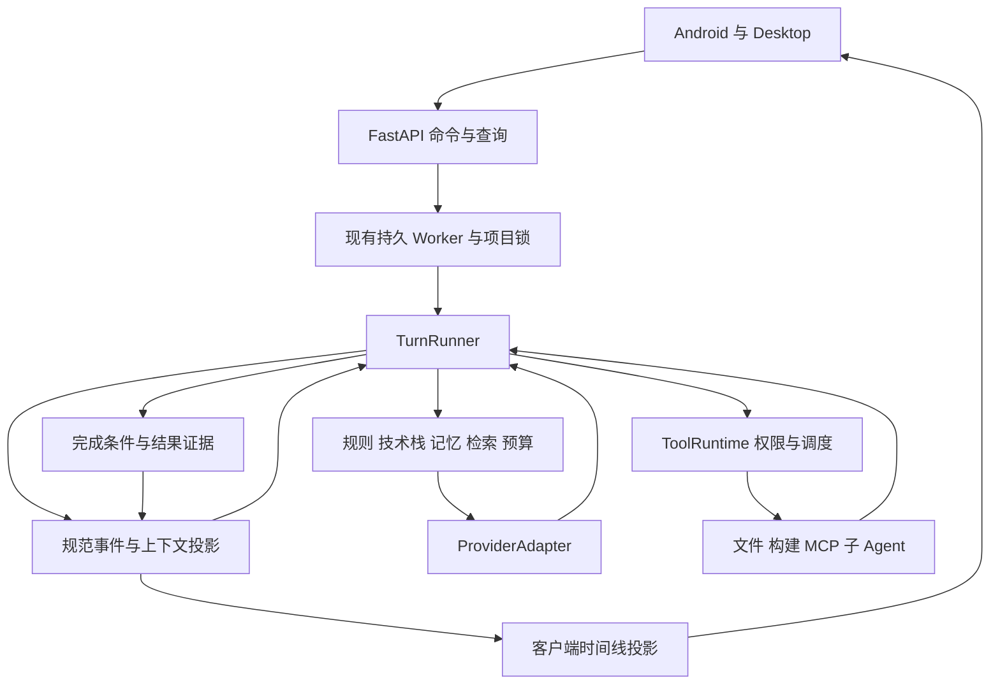

# Claude Code 源码对 Android Agent 的参考价值与升级设计

阅读日期：2026-09-09。依据当前工作区中的源码；以下建议未修改业务实现。

最值得借鉴的是 Claude Code 对执行过程的控制：工具契约、上下文预算、计划与权限、可中断执行、结果证据，以及让这些状态在界面上清楚呈现。Android Agent 已经具备不少对应模块，下一步应先补齐现有链路的正确性，再把 Android 的预览、构建、安装与反馈连成产品闭环。

## 1. 阅读范围与结论边界

对 `src` 建立了完整文件索引：1,902 个代码文件，其中 TypeScript 1,332 个、TSX 552 个、JavaScript 18 个，合计约 30.4 MB。重点追踪了执行循环、工具调度、压缩、权限、文件编辑、计划、Skills、MCP、记忆、子 Agent、远程连接和时间线，并与本项目对应实现交叉阅读。**这不是对 1,902 个文件逐行审计，也不是 Claude Code 全产品功能认证。**

这份源码存在三个需要在参考时区分的层次：

- 可直接阅读的实现，如 `query.ts`、`StreamingToolExecutor.ts`、文件编辑校验。
- 被 `feature(...)` 或运行时开关控制的实现，如 fork、cached microcompact、context collapse。代码存在不代表当前发行版默认启用。
- 当前快照缺失的依赖。例如引用到的 `src/types/message.ts`、`src/types/tools.ts`、`src/services/compact/cachedMicrocompact.ts` 不在目录中；根目录和 `src` 也没有这套 TypeScript 工程的 `package.json`。部分 TSX 包含 React 编译结果和内联 source map。因此不能把这份目录直接视为已验证可独立构建的完整工程。

本报告不判断该快照的官方来源或版本。涉及 Claude Code 的陈述均指当前本地代码，不把实验分支、代码注释中的线上统计或缺失模块推断成已验证的产品事实。

## 2. 本项目已经具备什么

以下是实现层面的基线，不代表本次运行过全部客户端与服务端测试。

| 能力 | 本项目证据 | 应采取的方向 |
| --- | --- | --- |
| Conversation / Turn / 规范事件 | [conversation_events.py](/Users/mac/Android-Agent/agent/conversation_events.py)、[conversation_context.py](/Users/mac/Android-Agent/agent/conversation_context.py:75) | 保留单一历史事实源与跨 Provider 投影 |
| 持久任务与控制 | [worker.py](/Users/mac/Android-Agent/agent/worker.py:41)、[jobs.py](/Users/mac/Android-Agent/agent/jobs.py) | 深化中断语义与恢复可见性 |
| 工具注册、校验与审批 | [tool_registry.py](/Users/mac/Android-Agent/agent/tool_registry.py:20)、[tool_runtime.py](/Users/mac/Android-Agent/agent/tool_runtime.py:320) | 扩展契约并修正动态工具作用域 |
| 显式上下文、索引、项目记忆 | [explicit_context.py](/Users/mac/Android-Agent/agent/explicit_context.py:104)、[context_planner.py](/Users/mac/Android-Agent/agent/context_planner.py:71) | 提升检索质量与实际注入可靠性 |
| 跨轮摘要与任务内压缩 | [conversation_summary.py](/Users/mac/Android-Agent/agent/conversation_summary.py:28)、[compact.py](/Users/mac/Android-Agent/agent/compact.py:154) | 引入统一模型预算、结果外置与压缩恢复 |
| Rules / Skills / Hooks / MCP | [rules.py](/Users/mac/Android-Agent/agent/rules.py)、[skills.py](/Users/mac/Android-Agent/agent/skills.py)、[hooks.py](/Users/mac/Android-Agent/agent/hooks.py)、[mcp_manager.py](/Users/mac/Android-Agent/agent/mcp_manager.py) | 把发现、加载、执行和授权分清 |
| 子 Agent 与 worktree | [subagents.py](/Users/mac/Android-Agent/agent/subagents.py:48)、[subagent_roles.py](/Users/mac/Android-Agent/agent/subagent_roles.py:73) | 强化任务交接、证据与合并验证 |
| 改动审阅、历史与恢复 | [workspace.py](/Users/mac/Android-Agent/agent/workspace.py:182)、[history.py](/Users/mac/Android-Agent/agent/history.py:38) | 保留快照设计，补编辑前版本检查 |
| 双端时间线 | [agent-timeline.js](/Users/mac/Android-Agent/desktop/src/agent-timeline.js)、[ConversationTimelineBuilder.kt](/Users/mac/Android-Agent/android-app/app/src/main/java/com/androidagent/client/ConversationTimelineBuilder.kt) | 完善语义摘要与长会话体验 |
| 构建反馈、Trace、Usage | [feedback.py](/Users/mac/Android-Agent/agent/feedback.py:235)、[turn_trace.py](/Users/mac/Android-Agent/agent/turn_trace.py)、[usage_inspector.py](/Users/mac/Android-Agent/agent/usage_inspector.py) | 从展示结果提升到验证完成条件 |

项目的差距更多在“已有能力是否可靠衔接”，不在“有没有再增加一个 Agent 功能”。

## 3. 最值得学习的架构设计

### 3.1 让执行循环独立于界面和模型协议

参考：[QueryEngine.ts](/Users/mac/Android-Agent/src/QueryEngine.ts:184)、[query.ts](/Users/mac/Android-Agent/src/query.ts:241)。

`QueryEngine` 维护一次 Conversation 的消息、文件读取状态、usage 和取消控制；`submitMessage()` 开启一个新轮次。`queryLoop` 用明确的跨迭代状态处理模型响应、工具执行、压缩、失败恢复和停止条件，通过异步生成器输出事件。

需要准确理解其边界：`QueryEngine` 的说明明确写着主要提取 headless/SDK 路径，REPL 接入仍是后续阶段。值得学习的是职责划分，不能据此宣称它已经完成全部入口统一。

本项目的 OpenAI-compatible 和 Anthropic 循环分别位于 [loop.py:633](/Users/mac/Android-Agent/agent/loop.py:633) 和 [loop.py:1188](/Users/mac/Android-Agent/agent/loop.py:1188)，压缩、steer、工具结果、自动构建等逻辑存在两套分支。

建议逐步抽出三个边界：

1. `ProviderAdapter`：仅负责请求编码、流解码、usage、工具参数和模型错误分类。
2. `TurnRunner`：负责本轮状态机、预算、停止/暂停、工具调度和完成验证。
3. `ConversationSession`：以现有规范事件重建上下文、保存本轮事件、管理已读取文件版本。

先抽公共函数并让两条现有路径共享，再替换循环；不要一次重写整个 `loop.py`。验收重点是同一事件 fixture 在两个 Provider 下仍然保持工具调用和结果完整配对。

建议结构如下，名称是设计提案：

### 3.2 把工具升级成完整的能力契约

参考：[Tool.ts](/Users/mac/Android-Agent/src/Tool.ts:362)。

Claude Code 的工具定义不仅包含名称、schema 和 handler，还声明：

- `isReadOnly(input)`、`isConcurrencySafe(input)`、`isDestructive(input)`。
- `interruptBehavior()`，区分可取消与需要等待的操作。
- `validateInput()`、`checkPermissions()`、输入等价判断。
- 输出 schema、结果体积上限、进度通知。
- 搜索提示、延迟加载标记、展示名称和工具摘要。

本项目的 `ToolSpec` 已覆盖风险、审批、超时和恢复策略。建议增补：

| 建议字段 | 用途 |
| --- | --- |
| `concurrency_policy` / `resource_keys(input)` | 判断是否可并发，以及访问哪个 workspace、文件、Gradle 缓存或终端 |
| `interrupt_behavior` | 让界面区分“已收到停止”与“操作已停止” |
| `output_schema` / `result_budget` | 统一结构化输出与模型可见内容上限 |
| `effect_kind` / `idempotency_policy` | 明确重试和恢复时能否再次执行 |
| `presentation` | 提供类别、标题、摘要、目标路径、进度等跨端语义 |
| `scope` / `catalog_version` | 防止用户、项目之间动态工具混用 |

不要把 Claude Code 的 JSX 渲染器搬到 Python。服务端返回受约束的展示数据，Android 和 Desktop 用各自组件渲染；模型输出的任意 HTML 不能成为工具 UI。

### 3.3 并发执行与协议正确性分开设计

参考：[StreamingToolExecutor.ts](/Users/mac/Android-Agent/src/services/tools/StreamingToolExecutor.ts:40)。

这里维护 `queued → executing → completed → yielded` 状态；并发安全工具可以一起执行，非并发工具要求独占。输入先经过 schema 解析，不能可靠分类时按不可并发处理。进度可立即上报，工具结果通过 ID 关联；异常、中断和流式 fallback 有相应处理。源码中的 Bash 失败会取消兄弟任务，而独立读取失败不会一律取消其它读取。

本项目主循环目前是在完整模型响应之后逐个执行工具；子 Agent 并行不等于单轮工具并行。

推荐分两步实施：先做有界的只读工具批量并发；稳定后再让完整且验证通过的工具调用块尽早执行。建议首批只开放目录查询、文本搜索、文件读取，构建和写入保留独占约束。不要把 `read_only` 直接当作线程安全证明。

必须保证：并发完成顺序不会破坏 Provider 消息投影；中断仍有配对结果；模型流失败后不会自动重放已执行的写操作。现有会话恢复机制应继续作为底座。

### 3.4 上下文管理应成为分层系统

参考：[query.ts:370](/Users/mac/Android-Agent/src/query.ts:370)、[toolResultStorage.ts:769](/Users/mac/Android-Agent/src/utils/toolResultStorage.ts:769)、[autoCompact.ts:33](/Users/mac/Android-Agent/src/services/compact/autoCompact.ts:33)、[compact.ts:1415](/Users/mac/Android-Agent/src/services/compact/compact.ts:1415)。

源码体现的顺序包括工具结果总量预算、轻量清理、可选历史裁剪/折叠、自动压缩和请求超限恢复。特别值得参考的细节是：

1. **大输出外置。** 完整工具输出保存到文件，模型获得摘要和可继续读取的引用；不只是截掉尾部。
2. **历史投影稳定。** 记录某次结果具体被替换成什么，恢复时重用同一内容，避免每轮重新生成不同的历史前缀。
3. **按模型能力预留空间。** 上下文窗口要减去输出与安全余量；不能仅用一个固定字符数覆盖所有模型。
4. **压缩后恢复工作材料。** 重新提供近期文件、计划、已加载 Skill 和后台任务信息，并分别控制预算。
5. **压缩失败熔断。** 当前 `autoCompact.ts` 使用连续失败计数，不无限尝试相同压缩。

其中 cached microcompact、snip、context collapse 有开关或缺失依赖，不能原样依赖。应先实现跨 Provider 通用的结果预算与可重建摘要。

本项目已经有保留来源 `seq` 的结构化 checkpoint，也保留原始事件，这是很好的基础。但单轮压缩默认以 2,500,000 字符为阈值，仓库检索另有字符预算，规则也有独立预算；这些不等于一次完整模型请求的统一上限。

建议统一计算：

`可用输入预算 = 当前模型窗口 − 输出预留 − 协议开销 − 安全余量`

总量应包含系统提示词、Rules、Skills、工具 schemas、历史、记忆、显式附件、检索片段和图像。中文、代码与图片不能全部按固定“四字符一个 token”视为精确值；先保守估算，并用真实 usage 校准。压缩只改变投影，不删除规范事件。

对 Gradle、MCP 大 JSON、终端输出建立统一的 `artifact_id + preview + range-read` 契约；客户端和模型都可按范围读取完整结果。产物读取继承用户/项目权限，不能直接暴露服务器任意路径。

当前 [read_file](/Users/mac/Android-Agent/agent/tools.py:281) 主要从文件开头返回内容，超过 100,000 字符时截断。结果外置必须同时提供真正的分段读取或搜索接口，避免模型反复读到同一段预览，始终拿不到后半部分。

### 3.5 将提示词与项目能力匹配

参考：[systemPrompt.ts](/Users/mac/Android-Agent/src/utils/systemPrompt.ts:41)、[loadSkillsDir.ts](/Users/mac/Android-Agent/src/skills/loadSkillsDir.ts:117)、[FileEditTool.ts](/Users/mac/Android-Agent/src/tools/FileEditTool/FileEditTool.ts:1)。

源码将默认、特定 Agent、自定义追加提示词分层，并且支持 Skill 的元数据发现、按需读取和路径相关激活。本项目已经实现 Skills 元数据目录与 `load_skill`，不要重复做一个全文注入系统。

优先建立项目能力描述：UI 栈是 XML、Compose 还是混合；模块入口、包名、SDK、依赖目录、主题、导航和可用构建任务来自真实工程。提示词由“通用行为 + 项目能力 + 当前任务类型 + 路径规则 + 已加载 Skill”组合。

重要落差：当前 [prompts.py:10](/Users/mac/Android-Agent/agent/prompts.py:10) 固定要求 Kotlin + XML + ViewBinding；当前 [CreativeRecipe.kt:45](/Users/mac/Android-Agent/android-app/app/src/main/java/com/androidagent/client/creative/CreativeRecipe.kt:45) 却要求识别 Compose/XML，并可能进行最小 Compose 接入。两者会让模型收到冲突指令。

另外，`build_system_prompt()` 接受 `focus_paths`，但 [loop.py:191](/Users/mac/Android-Agent/agent/loop.py:191) 的主调用没有传入该参数。应把显式选中文件和工具实际访问文件纳入路径相关规则/Skill 发现，再审计是否成功注入。

建议优先制作四类 Android 工作流 Skill：应用 Recipe、修复 Gradle 错误、适配深色模式/大字体、分析运行崩溃。每个 Skill 应包含触发条件、需要读取的材料、执行步骤、验证条件与退出条件，而不仅是一段角色提示词。

### 3.6 语义代码检索应保留轻量回退

参考：[LSPTool.ts:56](/Users/mac/Android-Agent/src/tools/LSPTool/LSPTool.ts:56)。

源码支持定义、引用、hover、符号、实现和调用层级等操作，且仅在 LSP 已连接时启用。启示是让能力可发现并诚实降级。

本项目目前是本地 FTS 加 Kotlin/Java/XML/Gradle 的轻量解析，已经有 Android 资源关系价值。应先修复中文 query、位置映射和片段截取，再考虑接入语义服务。不要在这些基础问题未解决时先建设向量数据库。

建议统一返回 `path / start_line / end_line / symbol / source / content_version`，在 Context Inspector 标记来源为“文本匹配”“轻量符号”或“语义引用”。后续 LSP 不可用时仍使用当前索引，不阻断一般编辑。

## 4. 最值得学习的功能与交互

### 4.1 真正的 Plan 模式与方案选择

参考：[EnterPlanModeTool.ts](/Users/mac/Android-Agent/src/tools/EnterPlanModeTool/EnterPlanModeTool.ts:36)、[ExitPlanModeV2Tool.ts:61](/Users/mac/Android-Agent/src/tools/ExitPlanModeTool/ExitPlanModeV2Tool.ts:61)、[AskUserQuestion prompt](/Users/mac/Android-Agent/src/tools/AskUserQuestionTool/prompt.ts)。

计划在这里是权限和状态的变化，不只是模型输出一个列表；退出计划时能呈现计划内容，方案澄清可以带选项预览。

本项目的时间线已有 Plan 展示，但服务端运行模式主要是 `ask / workspace / read_only`，没有对应的完整计划生命周期。建议把“任务模式”和“权限档位”作为两个概念：分析/规划/执行描述工作目的，安全/标准等权限控制实际动作。

适合的 Plan 数据包括：目标、受影响文件、技术方案、备选方案、验证步骤、依赖变化、恢复点以及 revision。修改计划后旧 revision 的批准不能继续生效。计划确认不应隐式放开所有命令、网络和发布权限。

手机端使用方案卡与底部选择面板，桌面端使用可编辑计划区域。需求澄清只在影响结果时触发；用户已要求直接实现的小改动无需强制多走一次计划批准。复杂导航迁移、依赖替换、跨模块改造适合先规划。

### 4.2 工具批次摘要与渐进展开

参考：[CollapsedReadSearchContent.tsx:167](/Users/mac/Android-Agent/src/components/messages/CollapsedReadSearchContent.tsx:167)、[toolUseSummaryGenerator.ts](/Users/mac/Android-Agent/src/services/toolUseSummary/toolUseSummaryGenerator.ts:45)。

源码聚合搜索、读取、目录操作，区分运行与失败状态；活动提示设置最短显示时间，计数不因流式时序短暂回退而跳动。另有针对移动端单行展示的工具批次摘要生成器，失败时返回空结果，不影响主执行。

本项目已有连续同类工具折叠，不应再造一个 timeline。建议增加两层摘要：

- 确定性摘要：`读取 6 个文件 · 找到 2 个入口`、`构建失败 · 3 个错误`。
- 可选语义摘要：`已定位登录按钮样式来源`，仅基于已经完成的工具事实生成，并保留所引用的 tool IDs。

不要每个工具都额外调用模型。先用模板覆盖常见动作，对长批次异步生成一句摘要；失败、审批和需要用户处理的事项仍直接展示。摘要不能把 `failed` 改写成成功。

### 4.3 稳定阅读与输入体验

参考：[VirtualMessageList.tsx](/Users/mac/Android-Agent/src/components/VirtualMessageList.tsx:40)、[REPL.tsx:1252](/Users/mac/Android-Agent/src/screens/REPL.tsx:1252)。

值得学习的是长会话虚拟化、搜索定位、滚动锚点、按消息身份保存展开状态和减少无关状态刷新。终端特有的按键、行高计算和 Ink 渲染不适合直接搬到客户端。

本项目 Android 已有 ListAdapter/DiffUtil、稳定 ID 和约 80ms 合并刷新；桌面已有按 Turn 窗口展示。这些应保留。后续重点是：窗口变化后重新计算布局，跳转到搜索结果后仍能回到原阅读位置，审批出现不抢走正在输入的焦点。

继续遵守现有 [时间线契约](/Users/mac/Android-Agent/docs/CONVERSATION_TIMELINE_V2.md)：流式文本与最终文本使用相同消息身份。若要增加“工作说明”类别，应由协议明确提供，不让两端通过文字猜测消息身份。

### 4.4 运行中输入、停止与后台任务

参考：[messageQueueManager.ts:38](/Users/mac/Android-Agent/src/utils/messageQueueManager.ts:38)、[Tool.ts:421](/Users/mac/Android-Agent/src/Tool.ts:421)、[RemoteSessionManager.ts](/Users/mac/Android-Agent/src/remote/RemoteSessionManager.ts:39)。

源码统一处理用户输入、任务通知与待处理权限，优先级区分 `now / next / later`。远程会话将普通消息与控制请求分开，并区分查看者和控制者。

本项目已有 steer、follow_up、pause、resume、cancel、后台同步与审批通知。值得增加的是操作结果可见性：

- 用户输入显示“待处理 / 已交给 Agent / 已处理”，而非发送后就当作生效。
- 任务停止显示“正在终止构建”与“已停止”的区别。
- 同一审批在手机和桌面同时打开时，服务端决定哪次响应有效，其它端同步显示已处理。
- 连接断开、任务失败、任务仍在后台运行是三个不同状态。
- 后台等待模型、Gradle 或审批需要明确标记；长操作是否可中断由工具声明。

不要把 CLI 的模块级命令数组当成 FastAPI 多用户队列。保留现有数据库任务、租约与 fencing token，让临时 UI 状态订阅服务端事实。

### 4.5 安全编辑与可理解的恢复

参考：[FileEditTool.ts:278](/Users/mac/Android-Agent/src/tools/FileEditTool/FileEditTool.ts:278)、[fileHistory.ts:86](/Users/mac/Android-Agent/src/utils/fileHistory.ts:86)。

Claude Code 编辑前检查文件是否已读取、读取状态是否足够、读取后是否发生修改；历史快照与消息 ID 关联。它也有具体的限制，不能推断任意 shell 修改或外部副作用都能撤销。

本项目的 checkpoint 是内容寻址快照，并且已有恢复预览、revision 冲突检查和恢复前备份，这部分值得继续使用。当前 Agent 的 [write_file](/Users/mac/Android-Agent/agent/tools.py:301) 和 [str_replace](/Users/mac/Android-Agent/agent/tools.py:314) 没有携带读取时文件版本；字符串存在只能证明还能匹配，不能证明未覆盖并发编辑的意图。

建议把编辑前版本检查扩展到 Agent 工具：读取返回内容 hash，编辑提交 `expected_hash`，服务端在写入前原子校验；文件变动后返回结构化冲突，Agent 重新读取并调整。版本检查与写入要位于同一锁或原子操作范围。

界面至少清楚区分三件事：恢复代码但保留对话、从历史创建新分支、仅查看历史。后续会话分叉可以引用选定历史前缀建立新的 Conversation，不删除原始事件。安装过的 APK、外部下载和远端调用不能被“代码恢复”按钮暗示为已撤销。

### 4.6 子 Agent 的重点是任务边界与结果交接

参考：[exploreAgent.ts](/Users/mac/Android-Agent/src/tools/AgentTool/built-in/exploreAgent.ts)、[planAgent.ts](/Users/mac/Android-Agent/src/tools/AgentTool/built-in/planAgent.ts)、[forkSubagent.ts:107](/Users/mac/Android-Agent/src/tools/AgentTool/forkSubagent.ts:107)。

可以借鉴角色范围、工具集合、模型预算、背景通知、结构化汇报和 worktree 提醒。完整上下文 fork 在当前源码中受开关限制，并专门处理工具结果占位和缓存前缀一致性，复杂度明显高于“复制聊天记录”。

本项目已有 explore/reviewer/test_runner/implementer、依赖关系、并发上限、禁止嵌套派生、worktree 路径分配和角色工具白名单。下一步建议增加任务交接包：目标、约束、基准 revision、允许修改的范围、选定上下文、验收条件；结果包含文件、测试证据、未完成事项和补丁/快照引用。

优先提供 Android 特定组合：定位问题 → 修复 → 构建验证 → 独立审查。是否派生取决于独立性和收益；简单文案修改不需要多个 Agent。不要把完整父历史无条件传给每个子 Agent，也不要复制其提示词中的自动 commit 等行为约定。

### 4.7 Skills、MCP 和长期记忆的渐进加载

参考：[ToolSearchTool.ts](/Users/mac/Android-Agent/src/tools/ToolSearchTool/ToolSearchTool.ts:23)、[loadSkillsDir.ts:117](/Users/mac/Android-Agent/src/skills/loadSkillsDir.ts:117)、[memdir.ts:38](/Users/mac/Android-Agent/src/memdir/memdir.ts:38)、[findRelevantMemories.ts:39](/Users/mac/Android-Agent/src/memdir/findRelevantMemories.ts:39)。

值得借鉴的是先提供少量元数据，再按任务加载详细工具或记忆；记忆可以按主题组织，并携带更新时间。源码中的相关记忆选择会额外调用模型，不应误认为免费或唯一必要方案。

本项目已有本地 FTS、candidate → active 审批、来源事件、confidence 和冲突字段。建议继续使用这套可审计存储，优先改善检索与展示，再根据真实评测决定是否增加模型重排。

MCP 工具多时可以引入 `search_tools`：模型先看到工具目录摘要和少数常用 schema，选定工具后再加载 schema。普通 Provider 不能直接假设支持 Anthropic 的延迟工具协议，需要适配层把“发现后下一次请求带完整定义”实现清楚。

Skills 建议展示来源、版本、为何触发、已使用哪些资源；记忆展示来源任务、更新时间、最近使用情况和失效操作。扩展目录、记忆库、规则库职责不同，不应互相混作高优先级指令。

### 4.8 完成验证与成本解释

参考：[query.ts:1267](/Users/mac/Android-Agent/src/query.ts:1267)、[stopHooks.ts](/Users/mac/Android-Agent/src/query/stopHooks.ts:77)、[promptCacheBreakDetection.ts:33](/Users/mac/Android-Agent/src/services/api/promptCacheBreakDetection.ts:33)。

停止前的 Hook 可以提出阻止完成的错误，使主循环继续工作；API 错误则跳过普通 Stop Hook，避免错误与重试形成循环。缓存诊断通过系统提示词、工具 schema、模型等状态的变化解释缓存变化，而不是只显示一个命中率。

本项目已有最多两次修复的反馈循环以及 `honesty.py`，因此无需另起一套“自动修复 Agent”。建议把结束条件整理为可验证清单：请求修改的文件是否真的变化、要求的构建是否成功、必要测试是否执行、APK 是否来自本轮验证的代码版本。

`TurnCompleted` 事后通知与“结束前可以阻止完成”的验证器职责不同。建议在成功事件之前执行受预算约束的验证器；失败最多继续有限轮，停止和审批拒绝必须可以终止它。

Trace/Usage 后续增加模型等待、工具执行、审批等待、压缩、检索、子 Agent 的耗时与成本分类。缓存波动诊断先记录 hash 和原因，不默认保存完整提示词或源码 diff。任何节省比例均需以本项目同任务对照评测为依据。

## 5. 本次发现的具体落差

下面区分实际复现与静态观察。详细观测数据保存在 [reading-checks.json](/Users/mac/Android-Agent/.artifacts/claude-code-reference/reading-checks.json)。

| 优先级 | 发现 | 证据与实际影响 | 建议 |
| --- | --- | --- | --- |
| P0 | 动态 MCP 工具池按工具名全局共享 | [tool_registry.py:140](/Users/mac/Android-Agent/agent/tool_registry.py:140) 的全局 registry 允许同名覆盖；[mcp_manager.py:396](/Users/mac/Android-Agent/agent/mcp_manager.py:396) 的 handler 捕获 manager。模拟先注册 A、再注册 B，使用 A 的 ctx 调用同名工具，实际进入 B 的模拟 manager | 工具目录、查找、刷新与注销均按 user/project/session 隔离；执行时校验 owner |
| P1 | 记忆与普通文件混合可使 ContextPlanner 抛错 | [context_planner.py:218](/Users/mac/Android-Agent/agent/context_planner.py:218) 等位置直接访问 `s['rel_path']`，但 memory item 没有该键。模拟 active memory + related file 实际得到 `KeyError('rel_path')` | 用有类型的 context item；先判 kind，再读取 path；为混合来源添加回归 |
| P1 | 自动检索关键词忽略纯中文 | [context_planner.py:17](/Users/mac/Android-Agent/agent/context_planner.py:17) 仅提取拉丁标识符。`把登录按钮改成蓝色` 实际得到空数组 | 中文分词/适当 n-gram、资源文案检索与代码标识符扩展；保留有界原始 query |
| P1 | 自动符号片段没有按符号行截取 | [context_planner.py:175](/Users/mac/Android-Agent/agent/context_planner.py:175) 调用从文件开头取片段的 helper。模拟第 401 行的 `target()`，选中片段不包含该函数 | 按符号范围/行窗读取，合并重叠片段；复用显式 symbol 上下文的行窗设计 |
| P1 | 注释移除破坏符号位置映射 | [repo_parser.py:15](/Users/mac/Android-Agent/agent/repo_parser.py:15) 删除注释后匹配，却把偏移应用到原文本。样例中实际第 4 行的类被标成第 1 行 | 保留字符长度与换行的注释遮罩，或使用提供原始位置的解析器 |
| P1 | 技术栈提示词与 Recipe 要求冲突 | 固定 XML/ViewBinding 提示词与 Compose Recipe 适配要求同时存在；静态确认，未调用真实模型验证表现 | 项目能力描述和条件提示词 |
| P1 | Agent 编辑工具缺少读取版本约束 | `write_file`/`str_replace` 的参数与实现未校验读取时 hash；静态确认 | 统一版本化读取、编辑与冲突处理 |

MCP 复现使用纯模拟 manager，没有连接真实 MCP、读取别人的数据或证明线上已经发生泄露；它证明注册表与 handler 的组件级作用域错误。ContextPlanner 抛错在 [jobs.py:1508](/Users/mac/Android-Agent/agent/jobs.py:1508) 附近被捕获并回退为空 context bundle，因此影响可能表现为整包上下文丢失，而不是任务直接报错。界面应说明“上下文组装失败”，不能仅展示零条上下文让用户误以为没有相关材料。

中文空关键词仅说明当前自动符号/FTS 分支无法从这句提示提取词，不代表显式附件、独立工具检索或其它记忆检索完全不可用。

## 6. 面向 Android Agent 的产品设计

### 6.1 主工作流应围绕可运行结果

建议把现有能力串成以下过程：

`选择项目或 Recipe → 识别工程能力 → 选择必要方案 → 修改 → 查看差异 → 构建/测试 → 安装 → 收集实际运行反馈`

这是基于本项目定位的设计建议，不是从 Claude Code 复制来的现成功能。

| 界面区域 | 手机端设计 | 桌面端设计 |
| --- | --- | --- |
| 当前任务 | 顶部简洁状态：正在定位 / 修改 / 构建 / 等待选择 | Agent 面板持续显示阶段与当前动作 |
| 输入与控制 | 底部输入区保留补充要求、待发送消息、停止入口 | Composer 支持 steer/follow-up 并展示队列 |
| 工作过程 | 折叠批次摘要，失败和审批突出 | 支持展开日志并联动文件与终端 |
| 方案 | 少量可比较卡片，必要时显示视觉预览 | 计划正文、涉及文件和验证步骤可并排阅读 |
| 改动 | 先显示影响，再进入文件或 hunk | Monaco diff 与 Agent 说明联动 |
| 结果 | 构建状态、测试数、APK、安装入口、未验证项 | 改动与验证证据并排，允许打开完整产物 |
| 上下文 | 来源数量、失效提示和简洁 Inspector | 文件/规则/Skill/记忆/token 分类检查 |
| 连接 | 断线与任务状态分别显示，恢复后接上原位置 | 与手机共享服务端状态和审批结果 |

具体可新增六个组件，均应复用现有状态和列表：

1. **任务阶段条**：显示真实阶段，不使用假百分比。
2. **计划卡**：目标、影响范围、验证要求，复杂任务可以比较方案。
3. **工作摘要行**：一句事实摘要，点击展开关联工具。
4. **上下文状态条**：已选择的文件/记忆、预算状态、组装失败或过期提示。
5. **交付结果卡**：改动、构建、测试、APK 的同一轮证据。
6. **恢复预览面板**：列出将恢复/删除的文件和保留的对话，再提交带 revision 的操作。

### 6.2 创意广场升级为有验证流程的 Recipe

当前 Recipe 已有源码、最低 SDK、额外依赖、参考信息和应用提示词。建议补充机器可读的兼容条件、接入位置、设计参数和验收规则，例如目标是 Compose/混合工程，是否允许依赖变更，入口如何打开，深色模式/大字体/窄屏是否需要验证。

应用 Recipe 前先检查目标工程；执行结果应回链到 Recipe ID 和任务 ID。用户之后能知道某个页面来自哪条 Recipe、做了哪些适配、哪次 APK 包含该改动。

这比不断增加孤立动画卡片更容易形成可复用的 Android 开发工作流。先把“应用成功”的判定从提示词变成构建与接入证据，再扩充目录规模。

### 6.3 真正的图像和运行反馈是后续差异点

当前截图 Context 类型在 [explicit_context.py:29](/Users/mac/Android-Agent/agent/explicit_context.py:29) 中主要通过文本说明进入上下文；当前请求模型与投影路径未显示一个完整的图像附件上传、存储和跨 Provider 传递链路。不能把“截图说明 chip”当作 Agent 已看到像素。

可以参考 [FileReadTool.ts:249](/Users/mac/Android-Agent/src/tools/FileReadTool/FileReadTool.ts:249) 对图像类型、编码和尺寸元数据的区分，设计真正的图片附件：上传后获得受权限约束的 asset ID；存储尺寸和 MIME；根据 Provider 能力生成图片内容块；历史压缩保留引用与文字说明。

更远一步再连接模拟器截图、指定设备运行和 Logcat。验收要分别标记“已构建”“已安装”“已打开目标页面”“已执行视觉检查”。已有 APK 下载/安装能力不能替代后面三个状态的证据。

## 7. 推荐实施顺序

不对收益或工期给未经测量的百分比。以下按依赖和风险排序，每阶段都可独立评审。

| 阶段 | 交付内容 | 主要落点 | 通过条件 |
| --- | --- | --- | --- |
| A：修正现有链路 | MCP 作用域、混合上下文异常、中文检索、符号位置/片段、技术栈提示词 | `tool_registry`、`mcp_manager`、`context_planner`、`repo_parser`、`prompts` | 同名工具跨用户不串用；目标符号进入上下文；中文任务有有效候选；XML/Compose 规则不冲突 |
| B：可靠执行与预算 | 文件版本检查、ToolSpec 扩展、结果外置、统一预算、压缩恢复、完成验证 | `tools`、`tool_runtime`、`compact`、`conversation_summary`、`loop`、`jobs` | 陈旧编辑被拒绝；大输出可继续读取；压缩后约束保留；未验证结果不显示为已验证 |
| C：跨端工作流 | Plan 状态、批次摘要、输入队列回执、停止状态、结果卡和恢复预览 | `conversation_events`、`api`、双端 timeline/Composer | 重连无重复节点；已处理审批同步；停止确认真实；计划与执行证据可追踪 |
| D：扩展与差异化 | 有界只读工具并发、动态 ToolSearch、Android 工作流 Skills、子 Agent 交接、图像与设备反馈 | Provider adapter、调度器、Skills/MCP、附件与设备能力 | 先有顺序/取消测试，再开放并发；任务质量和延迟有对照；设备操作有真实证据 |

建议第一批工作单只包含：**MCP 隔离、上下文三类正确性问题、工程能力与提示词一致性**。下一批才加入版本化编辑、结果预算和统一完成验证。无需等待所有模块重构完再改善产品。

## 8. 验证方法与指标

本次实际执行了现有的三组离线测试：

| 命令 | 结果 |
| --- | --- |
| `python3 -m unittest discover -s tests -p test_conversation_context.py -q` | 19 项通过，退出码 0 |
| `python3 -m unittest discover -s tests -p test_context_quality.py -q` | 7 项通过，退出码 0 |
| `python3 -m unittest discover -s tests -p test_repo_index.py -q` | 13 项通过，退出码 0 |

另外对中文关键词、符号行号、符号正文截取、记忆与相关文件混合、同名动态工具作用域执行了最小样例。结果说明现有测试通过与这些边界缺口同时存在；不能用 39 项通过代替完整质量判断。本次未运行真实模型、Android 构建、桌面 UI 或真实设备验证。

后续建议在现有测试和 Eval 上增加这些具体场景：

- 两个用户/项目拥有相同 MCP server/tool 名，刷新、断连、调用都只影响自己的目录。
- 已选 memory、file、symbol、selection 同时存在，预算统计与注入结果一致。
- 纯中文任务命中 XML 文案；长文件末尾符号进入片段；注释前后位置准确。
- 同一文件读取后被用户修改，Agent 旧版本写入冲突，重新读取后可完成。
- 多个读取乱序完成时消息合法；写工具形成屏障；流失败不重复写。
- 大工具输出外置后仍可查到末尾错误；结果引用在恢复后继续有效。
- 压缩后保留用户约束、未解决事项、当前计划、已执行工具事实和来源。
- 手机/桌面同时响应审批只生效一次；断线后仍能查看任务真实结果。
- APK 与被验证的代码 revision/快照绑定；构建成功后又发生代码变化时显示产物过期。

量化时优先关注完成任务所需模型轮次、首次有效动作耗时、构建修复成功率、上下文命中率、约束召回、重连重复节点数、审批等待占比和每次成功任务成本。缓存命中率、token 减少或并发数量只是解释指标，不能单独当作产品成功。

## 9. 不建议直接照搬的部分

| 源码方向 | 原因 | 本项目选择 |
| --- | --- | --- |
| Ink/TUI、Vim 与终端专用布局 | 与 RecyclerView/Compose、DOM/Monaco 的渲染模型不同 | 参考信息层级、稳定身份和输入习惯 |
| Anthropic 专有缓存、内部 feature gate 和服务 | 当前快照含缺失依赖与内部接口 | 能力探测后可选启用，保留通用路径 |
| 完整权限分类器与绕过模式 | 与多用户服务和既有授权模型不直接等价 | 确定性权限、明确范围、审批审计 |
| 全量团队协作、自动 fork、后台记忆整理 | 会增加成本、状态和恢复复杂度 | 先完善当前四类子 Agent 与记忆检索 |
| 全部插件市场、企业管理、订阅与遥测系统 | 对当前 Android 开发闭环的直接收益有限 | 先交付少量可靠的内置工作流 |
| CLI 全局状态和本地文件存储约定 | CLI 的会话假设不等于多租户服务假设 | 用户/项目作用域、数据库规范事件、服务端授权 |
| 源码中的全部默认数值和提示词 | 与模型窗口、语言、权限和任务分布有关 | 用本项目配置与 Eval 决定默认值 |

## 10. 继续阅读源码的推荐路径

| 顺序 | 文件 | 阅读问题 |
| --- | --- | --- |
| 1 | [query.ts](/Users/mac/Android-Agent/src/query.ts:241) | 一轮什么时候继续、什么时候停止、失败后保留什么？ |
| 2 | [Tool.ts](/Users/mac/Android-Agent/src/Tool.ts:362) | 工具应向运行时和 UI 承诺什么？ |
| 3 | [StreamingToolExecutor.ts](/Users/mac/Android-Agent/src/services/tools/StreamingToolExecutor.ts:40) | 并发、进度、取消与结果如何衔接？ |
| 4 | [toolResultStorage.ts](/Users/mac/Android-Agent/src/utils/toolResultStorage.ts:769) | 大输出如何保存并稳定投影？ |
| 5 | [autoCompact.ts](/Users/mac/Android-Agent/src/services/compact/autoCompact.ts:241)、[compact.ts](/Users/mac/Android-Agent/src/services/compact/compact.ts:1415) | 压缩何时发生，如何避免忘记正在做的事？ |
| 6 | [permissions.ts](/Users/mac/Android-Agent/src/utils/permissions/permissions.ts:1071)、[FileEditTool.ts](/Users/mac/Android-Agent/src/tools/FileEditTool/FileEditTool.ts:278) | 通用权限与操作前校验如何分工？ |
| 7 | [计划入口](/Users/mac/Android-Agent/src/tools/EnterPlanModeTool/EnterPlanModeTool.ts:36)、[计划出口](/Users/mac/Android-Agent/src/tools/ExitPlanModeTool/ExitPlanModeV2Tool.ts:61) | 计划如何成为可批准、可恢复的状态？ |
| 8 | [loadSkillsDir.ts](/Users/mac/Android-Agent/src/skills/loadSkillsDir.ts:117)、[ToolSearchTool.ts](/Users/mac/Android-Agent/src/tools/ToolSearchTool/ToolSearchTool.ts:23) | 怎样减少默认上下文而保持能力可发现？ |
| 9 | [forkSubagent.ts](/Users/mac/Android-Agent/src/tools/AgentTool/forkSubagent.ts:107)、[fileHistory.ts](/Users/mac/Android-Agent/src/utils/fileHistory.ts:198) | 分叉、文件版本与历史如何保持一致？ |
| 10 | [批次摘要](/Users/mac/Android-Agent/src/services/toolUseSummary/toolUseSummaryGenerator.ts:45)、[虚拟列表](/Users/mac/Android-Agent/src/components/VirtualMessageList.tsx:40)、[远程会话](/Users/mac/Android-Agent/src/remote/RemoteSessionManager.ts:39) | 用户如何看懂并控制长时间运行的任务？ |

工程上的首要取舍是保留 Android Agent 已有的事件、任务、审批与快照体系，用上述机制提升它们的可靠性；产品上的首要取舍是让每次 Android 改动都能回到明确的运行结果和验证证据。
