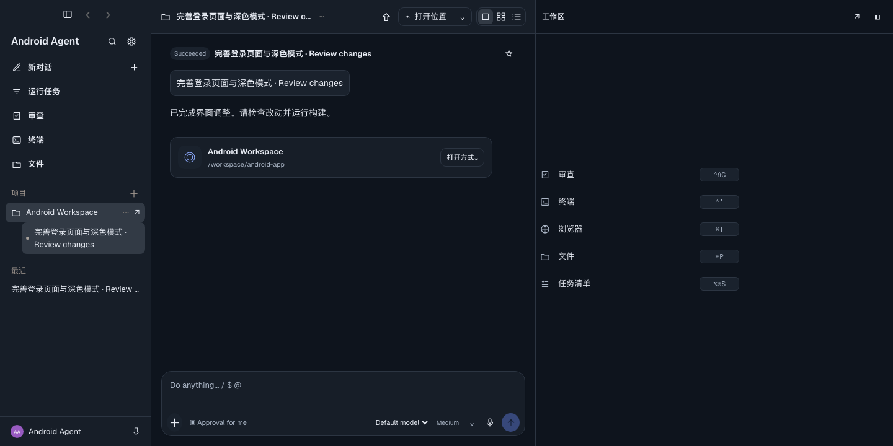
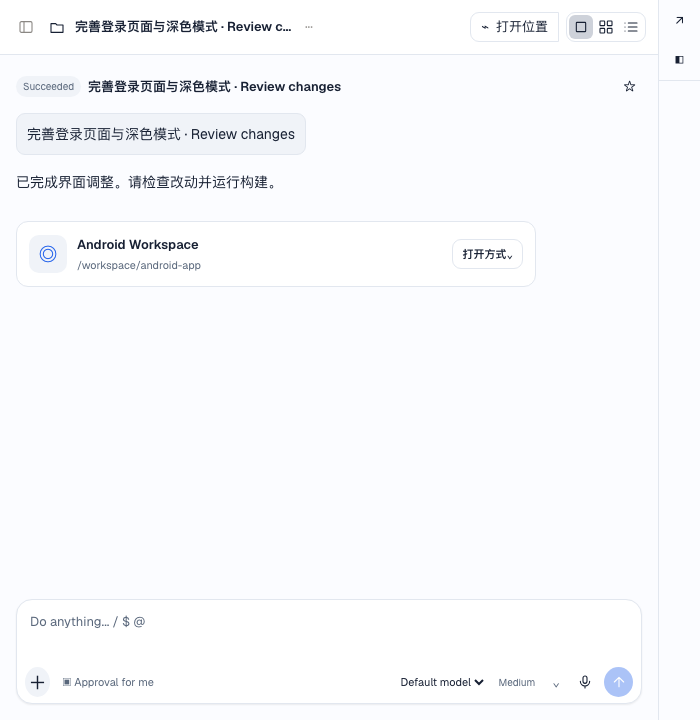

# Workbench UI V3

## 统一规范

手机和桌面使用同一套蓝色强调与中性表面：浅色背景 `#FBFCFF`、深色背景 `#0E141D`。卡片采用细边框和 16px/dp 圆角，主操作、次操作、文本操作有明确层级；成功、警告、危险继续使用语义颜色，不只依赖颜色表达状态。

Android 的 `workbench_widgets.xml` 统一按钮、卡片和工具栏；现有 XML 页面切换到共享按钮样式，动态 WorkspaceScreen 也使用相同主题。文字按钮最小高度 48dp、按内容增高，图标采用 24dp / 1.8dp 线条。已统一项目导航入口、历史入口和新增工具页面标签。

桌面 `workbench-ui.css` 在页面样式之后加载，统一传统工作台与 Agent Windows。涵盖表单、按钮、侧栏、标签页、状态栏、对话卡片、弹窗、代码和终端工具栏，以及 hover / focus / disabled 状态。保留原来的功能模块与主题切换。

## 布局防护

- Android 操作行按最长按钮的实际测量宽度决定横排或纵排；等宽槽位不会挤掉长标签。终端操作栏可横向滚动，按钮不会被压缩隐藏。
- 登录页改为可滚动布局，键盘出现或字体增大时可继续访问表单。Conversation 输入框与页面卡片统一圆角和内边距，保留原有系统栏/输入法 Insets 处理。
- 桌面窄窗口不再被侧栏的旧 min-width 撑开；Agent Windows 侧栏在窄窗口可通过按钮展开，并可用 Escape 关闭。
- 桌面 Composer 进入正常布局流，为实际高度预留空间，不再绝对定位覆盖最后一条消息。菜单/弹窗限高可滚动；终端标签与操作分行。
- 文件路径、标题等摘要允许明确省略；完整内容仍通过详情/代码滚动查看，不以强行缩小字体解决溢出。

## 验证与复现

- `./gradlew :app:assembleDebug :app:testDebugUnitTest :app:lintDebug`：88 个 JVM 单测，含新增布局决策测试。Lint 已不再受依赖校验缺项阻塞，0 errors；仍有既有的警告/建议，未创建忽略基线或关闭检查。
- 本机旧 JBR 的 AArch64 JIT 曾崩溃；验证时添加 `--max-workers=2 -Dorg.gradle.jvmargs='-Xmx2048m -XX:TieredStopAtLevel=1 -Dfile.encoding=UTF-8'`，不改变产品代码或 Lint 规则。
- 桌面 `npm run check`、`npm run test:unit`、`npm run test:screenshot`。新增 1440 / 1024 / 700 宽度 × 深浅主题矩阵，检查工作区非零尺寸、输入区不覆盖内容、窄屏侧栏开关。既有 Markdown、审批、改动、流式输出截图与交互回归继续运行。
- Android API 31 隔离模拟器检查项目、构建、Diff、文件、APK、登录与 Conversation 布局，包含 1.3 倍字体。`WorkbenchPreviewActivity` 仅存在于 Debug 源集，是不读取账号、不请求服务端、不执行任务的静态夹具；不进入 Release。
- 已实际打开软键盘并滚动登录页，登录/注册入口可到达；Conversation 输入区与发送按钮位于键盘上方。最终 Lint 报告为 0 errors、303 warnings、1 hint。

## 预览

手机键盘场景：[Conversation](ui-v3/android-composer-keyboard.png)、[登录表单滚动后](ui-v3/android-login-keyboard.png)。这些图片使用离线测试数据，不是真实项目任务。

静态夹具不是完整的在线任务功能测试。未覆盖每个厂商设备、所有系统版本、任意字体倍率和所有动态文本组合；不能据此承诺所有设备永远零遮挡。后续新增页面应复用共享样式，并扩充相同回归矩阵。

本轮不部署服务器；桌面源码可直接 `npm start` 预览。正式桌面安装包仍走项目现有签名/公证流程。
